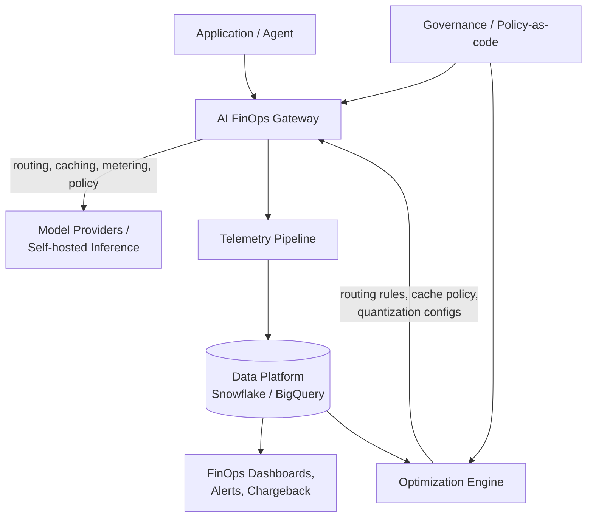

# AI FinOps Platform — Design Document

| | |
|---|---|
| **Status** | Draft for review |
| **Owner** | FinOps + Platform Engineering (cross-functional) |
| **Last updated** | 2026-07-26 |
| **Audience** | Engineering, Platform/Infra, Finance, Product, Data/ML leadership |

---

## 1. Purpose & Background

Inference — not training — now dominates long-term AI spend for most production systems. Agentic workflows can consume 5–50× the tokens/compute of a simple chatbot call, and usage is bursty and per-token/per-GPU-second, which breaks traditional annual/quarterly budgeting. 98% of organizations now report actively managing AI spend (vs. ~31% two years ago), and AI cost management is a top FinOps priority.

This document defines the **requirements, architecture, and phased rollout plan** for an AI FinOps platform: the discipline and system that brings cloud-FinOps rigor (visibility → optimization → operating model) to AI/LLM workloads.

**Goal:** give engineering, finance, and product a shared, real-time view of AI cost and unit economics, with governance guardrails and optimization levers, without slowing down shipping or degrading quality/latency.

**Non-goals (for this doc):** model training-cluster capacity planning (CapEx), general cloud FinOps for non-AI workloads, and vendor contract/procurement negotiation — these are referenced but not designed here.

---

## 2. Requirements Summary

| # | Category | Requirement |
|---|---|---|
| R1 | Visibility & Attribution | Granular cost tracking by model, provider, token type (input/output/cached), request, user/team/product/customer, environment, agent/workflow step |
| R2 | Visibility & Attribution | Virtual tagging to allocate shared resources (GPU clusters, KV caches) when native tags are missing |
| R3 | Visibility & Attribution | Unit economics: cost/token, cost/inference, cost/completed-task, cost/customer, cost/business-outcome |
| R4 | Visibility & Attribution | Separate training (CapEx-like) vs. inference (OpEx) spend |
| R5 | Predictability & Governance | Real-time/near-real-time monitoring, anomaly detection, budget-overrun alerts |
| R6 | Predictability & Governance | Budgets, quotas, rate limits per project/team/application |
| R7 | Predictability & Governance | Showback/chargeback for accountability |
| R8 | Predictability & Governance | Forecasting that models usage volatility, price changes, agentic scaling |
| R9 | Optimization | Model routing/cascading, caching, quantization, prompt compression, batching — with quality/latency SLA measurement |
| R10 | Optimization | Support hybrid managed-API + self-hosted model serving |
| R11 | Optimization | Feedback loops so eng/product can act on cost signals |
| R12 | Observability & Auditability | Full request tracing: prompt, model, tokens, latency, outcome |
| R13 | Observability & Auditability | Integration with cloud billing + LLM observability tools |
| R14 | Observability & Auditability | Compliance-grade logging for regulated data |
| R15 | Org & Process | Cross-functional ownership (FinOps + Eng + Product + Finance) |
| R16 | Org & Process | Policy-as-code for cost guardrails |
| R17 | Org & Process | Metrics tying spend to business value / ROI |

These map directly to the phases in §5.

---

## 3. Architecture Overview

Layered, **gateway-centric** design. The gateway is the one control point every request must pass through — it is what makes centralized metering, routing, caching, and policy enforcement possible without touching every calling application.



### 3.1 Components

1. **AI FinOps Gateway / Proxy Layer** (critical control plane)
   Sits between apps/agents and providers (OpenAI, Anthropic, Bedrock, Vertex, self-hosted). Responsibilities: real-time metering (tokens/latency/cost), intelligent routing/cascading, exact + semantic caching, prompt compression, budget/rate-limit/policy enforcement. Build on/around an existing gateway (e.g., LiteLLM, Portkey, Helicone-style proxy) rather than writing one from scratch.

2. **Observability & Telemetry Layer**
   LLM-aware tracing (Langfuse/LangSmith or custom spans), exported to a central warehouse using a normalized schema (FOCUS-style extension for AI costs). Correlates technical signals (GPU utilization, queue depth) with financial ones.

3. **Billing Aggregation & Unit Economics Platform**
   Ingests provider invoices + self-hosted GPU costs, applies virtual tagging/allocation, produces cost-per-inference/task/customer dashboards, anomaly detection, forecasts, showback reports. Tooling categories: Finout, CloudZero, Vantage, Kubecost (for k8s/GPU).

4. **Optimization & Serving Layer**
   Continuous batching, PagedAttention, quantization (INT8/INT4/FP8), speculative decoding; GPU right-sizing, predictive autoscaling with scale-to-zero, spot/preemptible capacity for batch/async, workload prioritization. Hybrid decision engine continuously evaluates the managed-API vs. self-hosted crossover point.

5. **Governance & Policy Layer**
   Policy-as-code (OPA-style) for cost thresholds, model-selection rules, approved providers; integration with Architecture Review Board processes; human-in-the-loop checkpoints for high-cost agentic workflows.

### 3.2 Reference Flow

```
Application / Agent
        ↓
[AI FinOps Gateway]  ← routing, caching, metering, policy enforcement
        ↓
Model Providers / Self-hosted Inference
        ↓
Telemetry → Data Platform → FinOps Dashboards / Alerts / Chargeback
        ↑
Optimization feedback (quantization, rightsizing, prompt changes)
```

### 3.3 Core Data Model (minimum viable schema)

| Entity | Key attributes |
|---|---|
| `inference_event` | request_id, timestamp, model, provider, env, tokens_in, tokens_out, tokens_cached, latency_ms, cost_usd, status |
| `attribution` | request_id, user_id, team_id, product_id, feature_id, customer_id, agent_id, workflow_id, step_id |
| `workflow_run` | workflow_id, parent_workflow_id (for sub-agents), task_outcome, total_cost_usd, step_count |
| `budget` | scope (project/team/app), period, limit_usd, alert_thresholds |
| `virtual_tag_rule` | resource_type, allocation_method (even split / usage-weighted / custom), target_dims |
| `policy` | scope, rule_type (model allow-list, cost cap, rate limit), enforcement_mode (block/warn) |

Design point: **attribute at the workflow/task level, not just the individual model call** — agentic systems spawn sub-agents, tool calls, and sandboxes that create adjacent costs that must roll up to one task/outcome.

---

## 4. Optimization Levers (reference, ranked by typical ROI)

| Lever | Typical savings | Effort | Notes |
|---|---|---|---|
| Model routing / cascading | 30–60%+ | Medium | Highest impact for mixed workloads |
| Prompt / semantic caching | 40–90% on hits | Low–Medium | Strong for repeated system prompts, FAQs |
| Prompt compression & tuning | 30–60% token reduction | Low | Treat prompts as code, version them |
| Quantization + efficient serving | 2–4× memory/throughput | Medium–High | Self-hosted mainly |
| Batching / async processing | Significant for non-real-time | Low | Pairs well with spot capacity |
| Attribution + showback | 20–30% behavioral reduction | Low | Cultural/visibility effect alone |

---

## 5. Phased Development Plan

The plan follows the stated principle: **start with visibility and attribution before aggressive optimization**, then layer governance, then optimization, then close the loop. Each phase has an explicit exit criterion so the next phase isn't started on an incomplete foundation.

### Phase 0 — Discovery & Foundations (2–4 weeks)
**Objective:** establish scope, inventory current AI spend surfaces, pick the gateway/tooling stack.

- Inventory all AI call sites: providers used, self-hosted endpoints, direct SDK calls that bypass any proxy today.
- Define the minimum tag/attribution taxonomy (team, product, feature, customer, environment, agent/workflow).
- Select gateway technology (build vs. adopt LiteLLM/Portkey/Helicone-style proxy) and telemetry backend (Langfuse/LangSmith/custom + warehouse).
- Stand up cross-functional working group: FinOps, platform eng, one ML/product rep per major consuming team, finance.
- **Deliverables:** call-site inventory, tagging taxonomy v1, tooling decision doc, working-group charter.
- **Exit criteria:** decision made and sponsored on gateway + telemetry stack; taxonomy agreed by all consuming teams.

### Phase 1 — Visibility & Attribution (R1–R4, R12) (4–8 weeks)
**Objective:** every AI call is observable and attributable before anything is optimized or gated.

- Deploy the AI FinOps Gateway in front of all provider calls (managed APIs + self-hosted); migrate call sites incrementally, gateway-first for all new code.
- Implement real-time metering: tokens (in/out/cached), model, provider, latency, request outcome.
- Implement virtual tagging for shared infra (GPU clusters, KV cache pools) where native tags don't reach.
- Land raw `inference_event` + `attribution` data in the warehouse; build first unit-economics views: cost/token, cost/inference.
- Full request tracing (prompt, model, tokens, latency, outcome) with compliance-appropriate redaction for regulated data.
- Separate training vs. inference spend lines in reporting.
- **Deliverables:** gateway in production for ≥80% of AI traffic; unit-economics dashboard v1; tracing pipeline live.
- **Exit criteria:** ≥95% of AI spend attributable to team/product/feature; cost/token and cost/inference numbers agreed as source-of-truth by finance.

### Phase 2 — Predictability & Governance (R5–R8, R13, R15–R16) (6–10 weeks)
**Objective:** move from "we can see it" to "we can bound it and predict it."

- Anomaly detection + alerting on spend spikes (per team/app/model).
- Budgets, quotas, and rate limits enforced at the gateway (project/team/app scope), with block/warn modes.
- Showback reports to team leads; chargeback for teams/BUs ready for it (opt-in first, mandatory later).
- Forecasting model that accounts for usage volatility, provider price changes, and agentic multi-step scaling (not linear extrapolation).
- Policy-as-code v1: model allow-lists, per-scope cost caps, approved-provider rules, enforced at the gateway.
- Formal cross-functional ownership (FinOps + eng + product + finance) with a named RACI and a recurring cost-review cadence.
- **Deliverables:** alerting live, budgets enforced for pilot teams, forecast v1, policy-as-code engine integrated with gateway.
- **Exit criteria:** budget breaches auto-alert within minutes; ≥1 full forecasting cycle validated against actuals within an agreed error band.

### Phase 3 — Optimization Without Quality Loss (R9–R11) (8–12 weeks, iterative)
**Objective:** apply cost levers with measured quality/latency impact, not blind cost-cutting.

- Model routing/cascading: cheap classifier routes simple tasks to small/fast models, complex ones to frontier models.
- Prompt/semantic caching (exact + embedding-based near-match) for repeated prompts/system prompts.
- Prompt compression and structured-output enforcement; treat prompts as versioned, tested artifacts.
- Batching/async processing for non-real-time workloads; evaluate spot/preemptible capacity for self-hosted batch.
- Quantization and efficient serving (continuous batching, PagedAttention, INT8/INT4/FP8, speculative decoding) for self-hosted models.
- Every lever ships with a **quality/latency scorecard** (accuracy delta, p99 latency, user satisfaction) before/after — no optimization merges without it.
- Feedback loop: cost dashboards surface directly to the owning eng/product team with concrete suggested actions, not just numbers.
- **Deliverables:** routing engine live for ≥1 major workflow; caching hit-rate dashboard; quantized self-hosted serving in prod for ≥1 model.
- **Exit criteria:** demonstrated cost reduction (target 30%+ on optimized workloads) with no regression beyond agreed quality/latency thresholds.

### Phase 4 — Advanced Optimization & Closed-Loop Architecture (R9–R10, ongoing) (ongoing)
**Objective:** continuously re-optimize as prices, model quality, and workloads shift.

- Hybrid decision engine: continuously reassess managed-API vs. self-hosted crossover point as prices/quality change.
- Predictive autoscaling incl. scale-to-zero for intermittent self-hosted workloads; workload prioritization (real-time vs. batch).
- Task/workflow-level cost tracking for agentic systems, including sub-agent, tool-call, and sandbox "adjacent" costs rolled up to one outcome.
- Human-in-the-loop approval checkpoints for high-cost agentic workflows above a policy threshold.
- Integrate cost efficiency into Architecture/Enterprise Review Board processes so shared platforms prevent duplicated, inefficient AI builds across business units.
- **Deliverables:** hybrid routing decisions automated with periodic re-evaluation; workflow-level cost rollups in dashboards; ARB checklist updated.
- **Exit criteria:** re-optimization cadence (e.g., monthly) running without manual re-analysis each time.

### Phase 5 — Business Value & ROI Discipline (R17) (ongoing)
**Objective:** move the conversation from "cost" to "cost vs. value."

- Tie unit economics to business outcomes: cost-per-completed-task, cost-per-customer, cost-per-resolved-ticket, etc., mapped to revenue/retention/efficiency metrics owned by product/finance.
- Quarterly ROI reviews per major AI product line using the cost + outcome data now available.
- Continuous recalculation of build-vs-buy and routing economics as model prices drop and open-source quality rises.
- **Deliverables:** ROI dashboard per product line; quarterly review cadence established.
- **Exit criteria:** at least one budget/roadmap decision demonstrably made using this data.

### Phase Summary Table

| Phase | Focus | Duration (indicative) | Key exit criterion |
|---|---|---|---|
| 0 | Discovery & foundations | 2–4 wks | Stack + taxonomy agreed |
| 1 | Visibility & attribution | 4–8 wks | ≥95% spend attributable |
| 2 | Predictability & governance | 6–10 wks | Budgets enforced, forecast validated |
| 3 | Optimization w/o quality loss | 8–12 wks | 30%+ savings, no quality/latency regression |
| 4 | Closed-loop optimization | Ongoing | Re-optimization runs on a cadence |
| 5 | ROI discipline | Ongoing | Decisions driven by cost+value data |

---

## 6. Success Metrics (North Star + supporting)

- **North star:** inference cost reduction of 40–70% at equal or better quality/latency, achieved without ad-hoc firefighting.
- Attribution coverage (% of spend mapped to team/product/feature/customer).
- Time-to-detect budget anomaly (target: minutes, not days).
- Forecast accuracy (actual vs. predicted spend, monthly).
- Cache hit rate and routing distribution (% routed to cheaper models without quality drop).
- Quality/latency regression rate on shipped optimizations (target: zero unmeasured regressions).
- % of teams with active showback/chargeback.

## 7. Risks & Mitigations

| Risk | Mitigation |
|---|---|
| Gateway becomes a latency/availability bottleneck | Design for horizontal scaling + regional deployment; fail-open with local caching for provider outage scenarios (define explicitly per SLA) |
| Optimization degrades quality silently | Mandatory quality/latency scorecards gating every optimization change (Phase 3) |
| Incomplete migration leaves "shadow" AI spend outside the gateway | Phase 1 exit criterion requires ≥95% coverage; treat non-gateway calls as a governance violation from Phase 2 onward |
| Org resistance to chargeback | Start with showback only; make chargeback opt-in before mandatory |
| Vendor/price volatility invalidates forecasts | Forecast model explicitly parameterizes provider price changes, not just usage volume |

## 8. Ownership & Operating Model

Cross-functional ownership from Phase 2 onward: FinOps owns budgets/forecasting, Platform Engineering owns the gateway/telemetry/optimization layer, Product/Eng teams own their routing and prompt decisions within policy, Finance owns chargeback and ROI framing. Policy-as-code changes go through the same review as security/architecture changes (Architecture Review Board).

## 9. Open Questions

- Build vs. adopt for the gateway (LiteLLM/Portkey/commercial) — decide in Phase 0 based on self-hosted model support and policy-engine extensibility.
- Chargeback vs. showback-only as the long-term steady state — depends on org appetite; revisit after Phase 2 pilot.
- Data residency/compliance constraints on full request tracing for regulated workloads — needs legal/compliance input before Phase 1 rollout to those teams.
